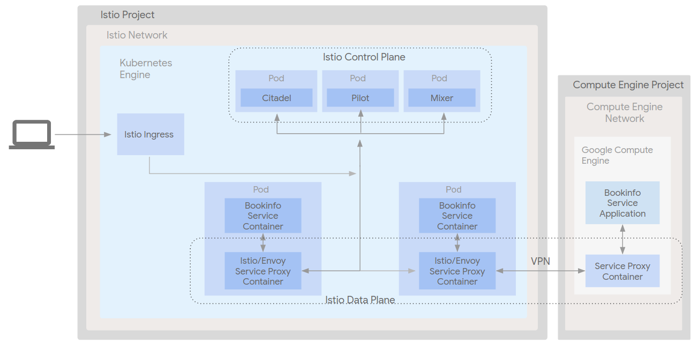
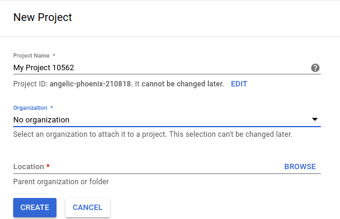
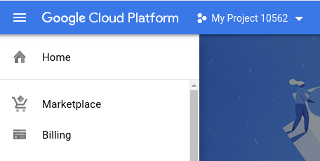

# Istio on Kubernetes Engine and Compute Engine

* [Introduction](#introduction)
* [Architecture](#architecture)
  * [Application architecture](#application-architecture)
  * [Infrastructure architecture](#infrastructure-architecture)
* [Prerequisites](#prerequisites)
  * [Tools](#tools)
* [Creating a project](#creating-a-project)
* [Deployment](#deployment)
  * [Noteworthy Aspects of the Deployment:](#noteworthy-aspects-of-the-deployment)
* [Validation](#validation)
* [Tear Down](#tear-down)
* [Known issues](#known-issues)
* [Troubleshooting](#troubleshooting)
* [Relevant Material](#relevant-material)

## Introduction

[Istio](https://istio.io/) is part of a new category of products known as "service mesh" software
designed to manage the complexity of service resilience in a microservice
infrastructure. It defines itself as a service management framework built to
keep business logic separate from the logic to keep your services up and
running. In other words, it provides a layer on top of the network that will
automatically route traffic to the appropriate services, handle [circuit
breaker](https://en.wikipedia.org/wiki/Circuit_breaker_design_pattern) logic,
enforce access and load balancing policies, and generate telemetry data to
gain insight into the network and allow for quick diagnosis of issues.

For more information on Istio, please refer to the [Istio
documentation](https://istio.io/docs/).

This repository contains demonstration code for Istio's mesh expansion feature
between resources in two Google Cloud Platform (GCP) projects connected via
VPN. The feature allows for a non-Kubernetes service running outside of the
Istio infrastructure on Kubernetes Engine to be integrated into and managed by
the Istio service mesh.

## Architecture

This demonstration will create a number of resources.

* A single (GKE) cluster with IP aliasing turned on in a custom network in
  project A
* A Google Compute Engine (GCE) instance in a custom network project B
* A VPN bridging the two networks containing the GKE cluster and the GCE
  instance
* The Istio service mesh installed in the GKE cluster
* The [BookInfo](https://istio.io/docs/examples/bookinfo/) application installed in the Istio service mesh
* A firewall rule allowing full SSH access to the GCE instance from any IP
  address
* A firewall rule allowing full access to the MySQL database from the GKE
  cluster

#### Application architecture


#### Infrastructure architecture



## Prerequisites

### Run Demo in a Google Cloud Shell

Click the button below to run the demo in a [Google Cloud Shell](https://cloud.google.com/shell/docs/).

[](https://console.cloud.google.com/cloudshell/open?cloudshell_git_repo=https://github.com/GoogleCloudPlatform/gke-istio-vpn-demo.git&amp;cloudshell_image=gcr.io/graphite-cloud-shell-images/terraform:latest&amp;cloudshell_tutorial=README.md)


All the tools for the demo are installed. When using Cloud Shell execute the following
command in order to setup gcloud cli. When executing this command please setup your region
and zone.

```console
gcloud init
```

### Tools

In order to use the code in this demo you will need to have have access to a
bash-compatible shell with the following tools installed:

1. [Terraform >= 0.11.7](https://www.terraform.io/downloads.html)
2. [Google Cloud SDK version >= 204.0.0](https://cloud.google.com/sdk/docs/downloads-versioned-archives)
3. [kubectl matching the latest GKE version](https://kubernetes.io/docs/tasks/tools/install-kubectl/)
4. Two [GCP projects](https://console.cloud.google.com/) with billing enabled

#### Install Cloud SDK
The Google Cloud SDK is used to interact with your GCP resources.
[Installation instructions](https://cloud.google.com/sdk/downloads) for multiple platforms are available online.

#### Install kubectl CLI

The kubectl CLI is used to interteract with both Kubernetes Engine and kubernetes in general.
[Installation instructions](https://cloud.google.com/kubernetes-engine/docs/quickstart)
for multiple platforms are available online.

#### Install Terraform

Terraform is used to automate the manipulation of cloud infrastructure. Its
[installation instructions](https://www.terraform.io/intro/getting-started/install.html) are also available online.

## Creating a project
In order to complete this demo, two projects need to exist, one for the GKE
cluster and a second for the GCE instance, which will be connected via a VPN.

To create projects:
1. Log in to the [GCP Console](http://console.cloud.google.com/)
1. Click on `Select a project` in the top navigating bar
1. Click on `New Project` in on the top right of the window:

  

1. Enter a project name, and note the project id below it.
(in this case, the project id is `angelic-phoenix-210818`):

  

1. Enable billing by clicking on the three lines in the top left corner
select `Billing` and enable it:

  

If necessary, repeat for a second project.

## Deployment

[Clone the repository](https://guides.github.com/introduction/git-handbook/) and change directory to the `gke-istio-vpn-demo`
directory.

Open the `scripts/istio.env` file and set:
  * `ISTIO_PROJECT` to the ID of the project you want to use for Istio infrastructure
  * `GCE_PROJECT` to the ID of the project you want to use for GCE
  * Any variables you wish to customize

Note that the ID of the project is not always the same as the name. Also, please note that when setting `ISTIO_PROJECT` and `GCE_PROJECT` they should be uncommented. Failure to do so will result in an error in the following step.

Once configuration is complete the demo cluster and app can be deployed.:

```shell
make create
```

This make target calls the `scripts/create.sh` script which will use Terraform to automatically build out necessary infrastructure, including a Kubernetes cluster, and will then use `kubectl` to deploy application components and other resource to the cluster.

### Noteworthy Aspects of the Deployment:
1. The GKE cluster uses IP aliasing, without this feature, the demo would not
work. IP Aliasing is a feature by which services and pods can have their IP
addresses set to values within a specific CIDR block, which allows them to be
known in advance of a deployment, and callable by other resources. This also
ensures that the IP addresses will not conflict with other GCP resources and
provides an additional mechanism for firewall traffic control (e.g. rules on the
pod may differ from those on the underlying host).
For more information on IP Aliasing see:
https://cloud.google.com/kubernetes-engine/docs/how-to/alias-ips

1. The GKE cluster's IP CIDR blocks are defined in the `istio.env` file and can
be changed in the event that other values are needed (e.g. if they conflict with
other IP address space).

1. Firewall and Routing rules are created at deployment time to facilitate the
necessary communication without exposing ports and services unnecessarily.

1. The VPN configuration (endpoints, firewalls and routing rules) are defined in
the included terraform configuration, `terraform/main.tf`. For more information on VPNs
see: https://cloud.google.com/vpn/docs/how-to

## Validation

To validate that everything is working correctly, first open your browser to
the URL provided at the end of the installation script.
You'll see a URL for the BookInfo web site. After taking a look, run:

```shell
./scripts/validate.sh <STARS>
```

where `<STARS>` is the number of stars to be returned as the rating given by the
first review on the product page.

Refresh the page in your browser; the first rating should reflect the
number of stars passed to the validate script. Behind the scenes, the validate
script is directly editing the database on the GCE VM that was integrated into
the mesh, proving that the BookInfo application is using the database on the VM
as the source of the rating data.

## Tear Down

To shutdown the demo run:

```shell
make teardown
```

This will destroy all the resources created by Terraform including everything deployed to the Kubernetes cluster.

## Troubleshooting

**Problem:** The Book Reviews section is returning an error stating that the ratings service is not available.

**Solution:** Istio may still be configuring the mesh. Wait for a minute so while refreshing the page.

----

**Problem:** The install script fails with a `Permission denied` when running Terraform.

**Solution:** The credentials that Terraform is using do not provide the necessary permissions to create resources in the selected projects. Ensure that the account listed in `gcloud config list` has necessary permissions to create resources. If it does, regenerate the application default credentials using `gcloud auth application-default login`.

----

**Problem:** Loss of GKE cluster network connectivity after 24 hours

**Solution:** Remove the GCE instance and rerun all steps involving the GCE setup

----

**Problem:** The install script times out while waiting for the internal load balancers to finish provisioning.

**Solution:** Likely the cause is a transient platform issue. Rerun the script as it is idempotent up to this point and should not run into any issues with infrastructure that already exists.

----

**Problem:** The install script gives an error like:

>ERROR: (gcloud.services.enable) User [{your-email address}] does not have permission to access service [compute.googleapis.com:enable] (or it may not exist): Project '{your-project-name}' not found or permission denied.

**Solution:** Enter the project Id and not the project name into `scripts/istio.env`

## Relevant Material

* https://github.com/istio/community
* https://istio.io/docs/guides/bookinfo.html
* https://cloud.google.com/kubernetes-engine/docs/tutorials/istio-on-gke
* https://cloud.google.com/compute/docs/tutorials/istio-on-compute-engine
* https://istio.io/docs/setup/kubernetes/mesh-expansion.html
* https://istio.io/docs/guides/integrating-vms.html


**This is not an officially supported Google product**
